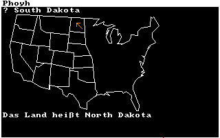
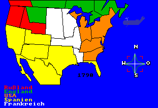

Do you know where the [US states](https://en.wikipedia.org/wiki/U.S._state) are?

This *quiz* game is about the Western states. You are shown a state on the map and must provide its name as the answer.

|  |  |
| :--: | :--: |
| Provide the right answer ... | ... or else you're corrected. |

The game language is *German* - but you only need to know some key words in order to play it.

# How to Use

Put the repository into a mounted directory of an *emulated* [Amiga 500](https://en.wikipedia.org/wiki/Amiga_500) and run the start script (assuming that AmigaBASIC is installed in mounted `Basic`):
```
execute w-states-quiz
```

You can also start using the workbench (`info`-files provided).

Alternatively, you can open the source file in your [AmigaBASIC](https://en.wikipedia.org/wiki/Amiga_Basic), but be sure to reside in the `src` library.

# Historic Territories

A sequel on the historic [US territories](https://en.wikipedia.org/wiki/Territories_of_the_United_States) was begun but left unfinished. Only the map drawing routine for *1790* is available without any option to take a quiz.

|  |
| :--: |
| North America in 1790 including whale animation <br> *Russia's hold on the Northwest up to Wyoming is probably only for game balancing...* |

# Triva

The vector waypoints are manually interpolated as scanners are hard to come by in *1990*...
